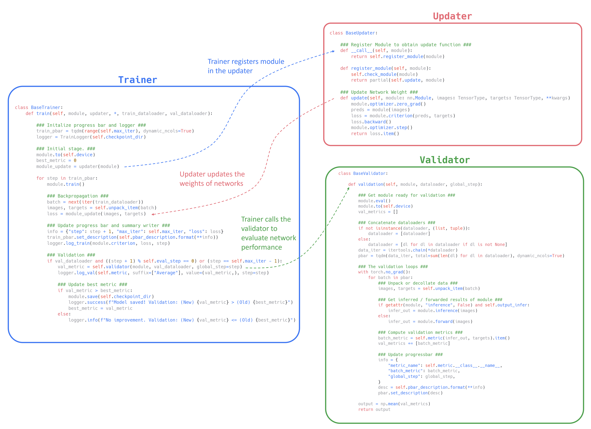

# DeepLake

[](https://www.python.org)  [](https://pytorch.org) [](https://github.com/psf/black)

> Simple deep learning templates. Presented by Laboratory of Analytics on Knowledge Engineering
(LAKE).<br>
> 簡單好用的深度學習訓練模板

### Framework Overview



## Installation and Requirements
1. Install [PyTorch](https://pytorch.org/) and clone this repo by running
```
git clone https://github.com/kevinkevin556/deeplake.git
```
2. (manual) Install dependencies: `monai[pydicom]`,  `ruamel.yaml`, `tqdm`, `loguru`, `tensorboard`, `dicom2nifti`,  `opencv-python`, `jsonargparse[omegaconf]`
  * We utilize [jsonargparse](https://github.com/omni-us/jsonargparse) to generate a easy-to-use CLI automatically.
3. (pip) Or run the following command in the terminal to install requirements
```setup
pip install -r requirements.txt
```
## Train and Evaluate Models using CLI

🔥 To **train** the models, run this command:

```train
python train.py --config <path_to_config_file>
```

🔥 To **evaluate** the model, run:

```eval
python test.py --config <path_to_config_file>
```

📋 See the example `[lenet06] train-cli.py` in [notebooks](./notebooks/) to build your own training/testing CLI.


## Imports
This project is setup as a package which means you can now easily import any file into any other file like so:

```python
from deeplake.modules.base.trainer import BaseTrainer
from deeplake.modules.base.updater import BaseUpdater
from deeplake.modules.base.validator import BaseValidator

lenet = LeNet5().cuda()
validator = BaseValidator(metric=batch_acc)
updater = BaseUpdater()
trainer = BaseTrainer(max_iter=1000, eval_step=334, validator=validator)

# train
trainer.train(
  module=lenet,
  updater=updater,
  train_dataloader=train_dataloader,
  val_dataloader=val_dataloader
)

# test
validator.validation(module=lenet, dataloader=test_dataloader)
```

📋 See notebooks [[lenet01-05]](./notebooks/) to use this framework as a package.

## Supports

* [Segmentation Models (smp)](https://github.com/qubvel-org/segmentation_models.pytorch)
* [Monai]()


<!--
## Contributing

>📋  Pick a licence and describe how to contribute to your code repository. 

--> 


